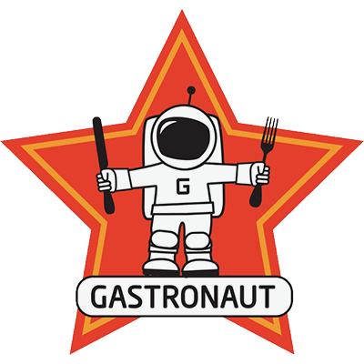

-------------------------------------------------------------------------------

Matt is an international research fellow at the Chinese Academy of
Sciences and an external research fellow at Harvard University. He is
currently studying the connections between ecosystems and global trade
networks, focusing on forest and agricultural landscapes. He has a
background in ecological systems theory and network analysis primarily
focusing on plant associated fungal and insect communities. He has an
un-abashed love for all things food (hence this course), and when not
working he is usually looking for something to eat.

Contact: MLau@Lasell.edu

-------------------------------------------------------------------------------
