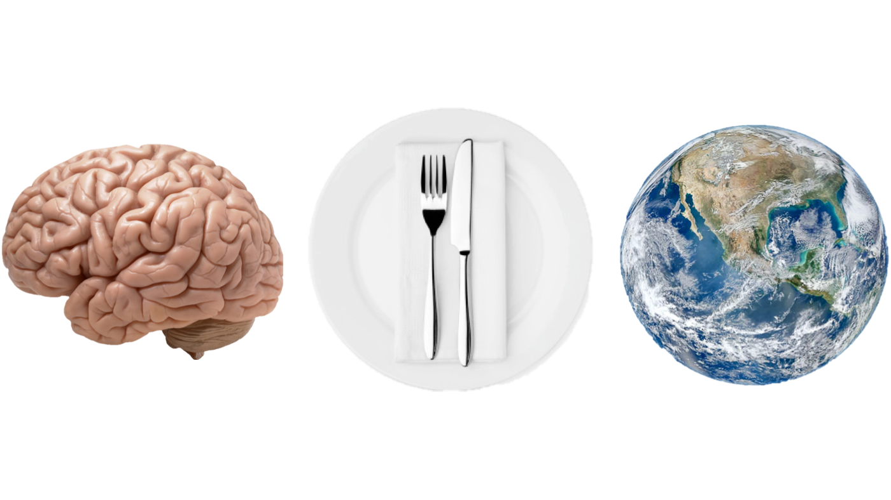

-------------------------------------------------------------------------------

Eating is inherently an ecological act. Although the need and desire
to connect to food is increasing, urbanization and globalization
continue to increase the distance between people and their
food. Concomitantly, findings from the new field of neurogastronomy
suggests that food and, especially, flavor have previously
unrecognized impacts on how we perceive and value the world. 

Through a synthesis of current topics in ecology, culinary arts and
the newly developing field of neurogastronomy, this course will:

- Introduce the topic of ecological foodways (i.e. how food links
  humans and nature).
- Explore the underlying neurological and physiological basis of
  flavor and how it influences our world.
- Improve culinary and tasting abilities through hands-on exercises.

## Meetings

- Thursdays 3:30pm-5:00pm from July 18 to August 22. 
- Lasell Village, Froebel 103C
- We will start each day with a brief presentation and discussing a
  topic for the day.
- The rest of the class will be devoted to activities primarily aimed
  at developing culinary and tasting skills related to the topic.

## Required Materials

- Other than an open-mind and desire to learn, nothing is explicitly
  necessary for the course. 
- However, although not required, it is strongly suggested that each
  participant obtain a journal/notebook to keep a journal during and
  (hopefully) after the course. 
- Readings will provided electronically. If other media are required,
  please let the instructor know. 

## Schedule

|         | **Topic**   | **Lab**   |**Goal**     |
|   ---   |-------------|-----------|-------------|
|Jul 18   | Course Overview | Flavor 101 and Journaling | Cover main course topics and learn about flavor|
|Jul 25   | Food in Your Head | How to Taste Better | Dive into neurogastronomy and learn wine/food tasting techniques |
|Aug 1    | Food on the Land | What is terroir?  | Learn about the landscape context of food and wine |
|Aug 8    | What is cuisine? | Flavor and Food Pairing  | Unpack what determines cuisine and how to construct flavor |
|Aug 15   | The Future of Food | Remedial Foraging  | Glimpse of recent food trends and learn how to identify "wild" foods |
|Aug 22   | Remembrance of Foods Past: Food and Memory | Potluck: Food Memories | Learn how food impacts memory (and visa-versa) and share our own food memories |

## Readings

<!-- |Jul 18   | Barber (pg1-20) Shepherd (pg1-20) | -->
<!-- |Jul 25   | Cronon (pg55-81) Shepherd (pg1-20)  | -->
<!-- |Aug 1    | Barber () Redzepi () McWilliams () Shepherd () | -->
<!-- |Aug 8    | Meadows () Sherman and Dooley ()  Nilsson () Martinez ()| -->
<!-- |Aug 15   | Shepherd ()  Baudar () Pollan () Barth () | -->
<!-- |Aug 22   | Lehrer () | -->

There will be about one hour of reading per week, which will be posted
electronically online. Purchasing these books is **not** required, but
if folks would like to, concepts and laboratory materials will
primarily be drawn from:

* *The Third Plate* (Dan Barber)
* *Neurogastronomy* (Gordon M. Shepherd)
* *Taste: What you're missing* (Barb Stuckey)

Additionally, some readings will also be included from:

* *Backyard Foraging* (Ellen Zachos)
* *NOMA* (René Redzepi)
* *A Revolution in Eating* (James E. McWilliams)
* *Thinking in Systems* (Donella H. Meadows)
* *The Food of a Younger Land* (Mark Kurlansky)
* *The New Wildcrafted Cuisine* (Pascal Baudar)
* *Backyard Foraging* (Ellen Zachos)
* *The Sioux Chef’s Indigenous Kitchen* (Sean Sherman and Beth Dooley)
* *The Omnivore’s Dilemma* (Michael Pollan)
<!-- * *Four Fish* (Paul Greenburg) -->
<!-- * *The Potlikker Papers* (John T. Edge) -->

## Course Leader: Matthew K. Lau (PhD.)

Currently, Matt is an international research fellow at the Chinese
Academy of Sciences and an external research fellow at Harvard
University. He is currently studying the connections between
ecosystems and global trade networks, focusing on forest and
agricultural landscapes. He has a background in ecological systems
theory and network analysis primarily focusing on plant associated
fungal and insect communities. He has an un-abashed love for all
things food (hence this course), and when not working he is usually
looking for something to eat.

Contact: MLau@Lasell.edu

<!-- ## Handouts -->
<!-- * Flavor basics (Meeting 1) -->
<!-- * Journaling: Natural observations (Meeting 1) -->
<!-- * How to Get Bitter (Meeting 2) -->
<!-- 	* *15 Ways to get more out of every bite* (Stuckey p348–358) -->
<!-- * Aroma Wheel (Meeting 2) -->
<!-- * Wine tasting primer (Meeting 2) -->
<!-- * Smell identification primer (Meeting 3) -->
<!-- * Wabi-sabi and washoku (Meeting 4) -->
<!-- * Food pairing basics (Meeting 4) -->
<!-- 	* *Flavor Balancing: Counterpoint Ingredients* (Stuckey p330–331) -->
<!-- * Foraging Basics (Meeting 5) -->
<!-- * Preserving Flavor (Meeting 5) -->
<!-- * Take Care of Your Sniffer! (Meeting 6) -->

<!-- ## Matt's Weekly Forage (5 minute ITEM-ization) -->

<!-- * Jul 18: Dandelions -->
<!-- * Jul 25: Milkweed Flowers and Elder Flowers -->
<!-- * Aug 01: Sassafrass -->
<!-- * Aug 08: Wild Garlic -->
<!-- * Aug 15: Cherries -->
<!-- * Aug 22: Sumac and Apples -->

<!-- # Field Trips -->
<!-- * Foraging near Lasell Residences -->
<!-- * Food at the Museum (Harvard Art Museum) -->

<!-- # Videos -->
<!-- * Julia Child -->
<!-- * http://www.phaidon.com/agenda/food/video/2010/december/16/the/hen/and-the-egg-rene-redzepis-signature-dish/ -->
<!-- * /Meat Eater/ “Origins of Conservation: New Mexico Turkey -->
<!-- * /Meat Eater/ “Why eat game from the land where you hunt” https://m.youtube.com/watch?v=9ZAdi7qPo8w&t=0s&list=PLrwvK9BVMF2dsVaJBQc_jBfMcIwUHczGa&index=14 -->
<!-- * /Meat Eater/ “North American Model of Wildlife Conservation” https://m.youtube.com/watch?v=ukqzPNckrbg&list=PLrwvK9BVMF2dsVaJBQc_jBfMcIwUHczGa&index=27&t=0s -->
<!-- * /The Sioux Chef/ http://sioux-chef.com/social/ -->
<!-- * /Zagat: North America’s Original Cuisine/ https://m.youtube.com/watch?feature=youtu.be&v=uAvPUBS3EFg -->

-------------------------------------------------------------------------------
