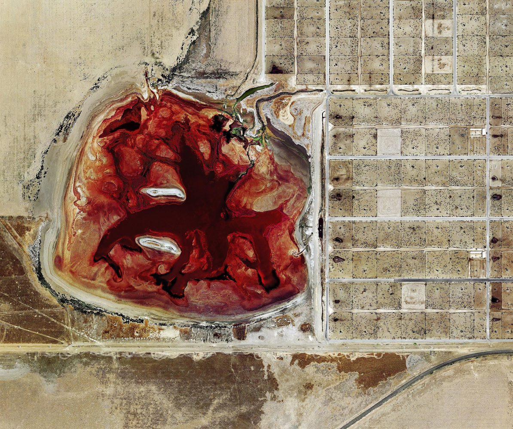

<!--   -->

-------------------------------------------------------------------------------

## Week 1 

- [Barber 1-22](pdf/readings/Barber1-22.pdf "Download")
- [Shepherd 11-32](pdf/readings/Shepherd11-32.pdf "download")
- [Davis (in Kurlansky) 80-84](pdf/readings/Kurlansky-Davis-80-84.pdf "Download")

## Week 2

- [Barber 78-99](pdf/readings/Barber78-99.pdf "download")
- [Shepherd 155-162](pdf/readings/Shepherd155-162.pdf "download")
- [Shepherd 165-173 and 192-199](pdf/readings/Shepherd165-173_192-199.pdf "download")
- [Shepherd 210-211](pdf/readings/Shepherd210-211.pdf "download")
- [Kurlansky 103-106](pdf/readings/Kurlansky103-106.pdf "download")

<!-- ## Week 3 -->
<!-- Barber234-250.pdf -->
<!-- Meadows86-94.pdf -->
<!-- Zachos1-6.pdf -->

<!-- ## Week 4 -->
<!-- Nilsson254-255.pdf -->
<!-- Alan-Nilsson21-28.pdf -->
<!-- Sherman-Dooley1-15-164-183.pdf -->
<!-- Jacobson20-28.pdf -->

<!-- ## Week 5 -->
<!-- Cronon54-81.pdf -->
<!-- Shepherd on Memory -->
<!-- Stuckey on Memory -->

<!-- ## Week 6 -->
<!-- Barber428-447.pdf -->

-------------------------------------------------------------------------------

